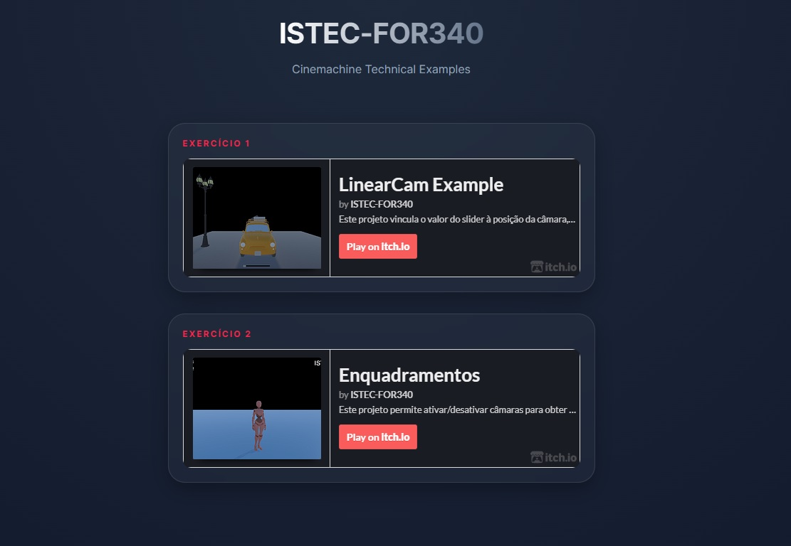

# 🎮 Cinemachine Technical Showcase

A professional Unity repository demonstrating advanced **Cinemachine** implementations. This project serves as both a live portfolio and a functional starter template for students to clone, study, and extend.

---

## 🚀 Quick Links
* **🌐 [Live Web Portfolio](https://istec-for340.github.io/Cinemachine-WebBuild-itch/)** - Interactive showcase of all exercises.
* **🕹️ [Itch.io Collection](https://istec-for340.itch.io/)** - Play individual builds in the browser.

---

## 📖 Student Guide: Getting Started

This repository contains the **full Unity project source**. Students are encouraged to clone this repo to inspect the Virtual Camera configurations.

### ⚙️ Installation
1.  **Clone the repository:**
    ```bash
    git clone [https://github.com/ISTEC-FOR340/Cinemachine-WebBuild-itch.git](https://github.com/ISTEC-FOR340/Cinemachine-WebBuild-itch.git)
    ```
2.  **Open in Unity:** * Open Unity Hub.
    * Click **Add** -> **Add project from disk**.
    * Select the `UnityProject` folder inside this repository.
    * *Recommended Version: Unity 2022.3 LTS or higher.*

---

## 📸 Technical Showcase

*Visualizing camera paths and framing constraints within the Unity Editor.*

---

## 🛠 Project Modules

The project is structured into specific technical exercises:

### 1. LinearCam (Exercício 1)
* **Core Concepts:** Tracked dollies, waypoint interpolation, and path physics.
* **Key Components:** `CinemachineDollyCart`, `CinemachineSmoothPath`.
* **Play:** [Itch.io Link](https://istec-for340.itch.io/linearcam-example)

### 2. Enquadramentos (Exercício 2)
* **Core Concepts:** Dynamic framing, screen-space composition, and occlusion handling.
* **Key Components:** `CinemachineClearShot`, `Composer` (Dead Zones/Soft Zones).
* **Play:** [Itch.io Link](https://istec-for340.itch.io/enquadramentos)

---

## 📂 Repository Structure

| Folder/File | Purpose |
| :--- | :--- |
| `📂 UnityProject` | **Source Code.** Contains all Scenes, Prefabs, and Scripts. |
| `📂 assets` | Static assets and CSS for the GitHub Pages portfolio. |
| `📄 index.html` | The landing page for the web showcase. |
| `📄 Cinemachine_ex.jpg` | Technical reference image for documentation. |

---

## 🛠 Tech Stack
* **Engine:** Unity (Universal Render Pipeline)
* **Package:** Cinemachine 2.9.x / 3.0
* **Deployment:** WebGL via GitHub Pages & Itch.io
